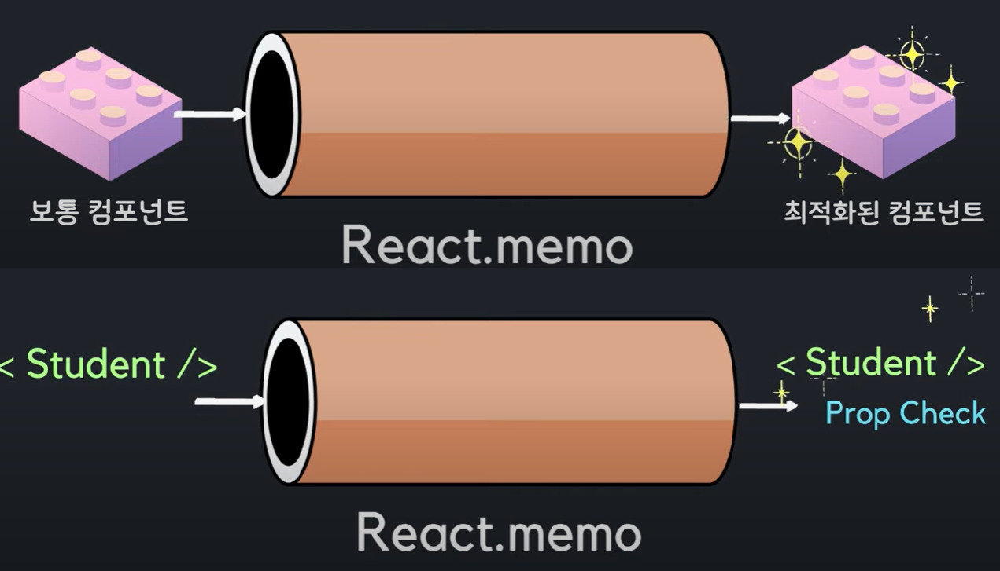
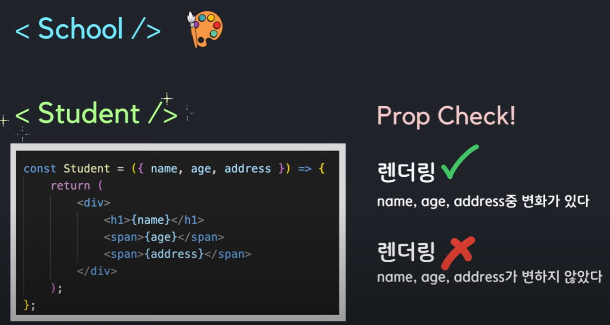

# 별코딩 컴포넌트 최적화

리액트에서는 기본적으로 부모컴포넌트가 렌더링이 되면 자식컴포넌트도 랜더링이 됨


# React.memo




prop가 바뀌지 않았다면 이미 렌더링한 화면을 재사용

React.memo의 memo는 memoization을 뜻함

## React.memo를 사용하기 적합한 상황

- 컴포넌트가 같은 Props로 자주 랜더링 될 때
- 컴포넌트가 렌더링이 될때마다 복잡한 로직을 처리해야한다면

주의점 : React.memo는 **_오직 Props 변화에만_** 의존하는 최적화 방법

만약에 useState,useReducer,useContext를 사용한다면
Props의 변화가 없더라도 state나 context가 변한다면 다시 렌더링됨을 알아야한다.

### React.memo 사용방법

최적화하고 싶은 자식 함수형 컴포넌트를
memo()로 감싸준다.

ex)

```js
import React, { memo } from 'react';

const Child = ({ name }) => {
  console.log('자녀 컴포넌트 렌더링!');
  return (
    <div
      style={{
        border: '2px solid powderblue',
        padding: '10px',
        margin: '10px',
      }}
    >
      <h1>자녀</h1>
      <p>lastName: {name.lastName}</p>
      <p>firstName: {name.firstName}</p>
    </div>
  );
};

export default memo(Child);
```

최적화 하고싶은 부분을 memo()로 감싼다.
렌더링이 될 상황에 놓일 때마다 prop체크를 하게된다.
props에 변화가 없다면 렌더링을 하지 않는다.
