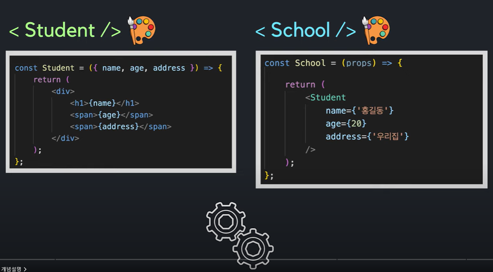

# 별코딩 컴포넌트 최적화

리액트에서는 기본적으로 부모컴포넌트가 렌더링이 되면 자식컴포넌트도 랜더링이 됨

# React.memo

prop가 바뀌지 않았다면 이미 렌더링한 화면을 재사용

React.memo의 memo는 memoization을 뜻함

## React.memo를 사용하기 적합한 상황

- 컴포넌트가 같은 Props로 자주 랜더링 될 때
- 컴포넌트가 렌더링이 될때마다 복잡한 로직을 처리해야한다면

주의점 : React.memo는 **_오직 Props 변화에만_** 의존하는 최적화 방법

만약에 useState,useReducer,useContext를 사용한다면
Props의 변화가 없더라도 state나 context가 변한다면 다시 렌더링됨을 알아야한다.
